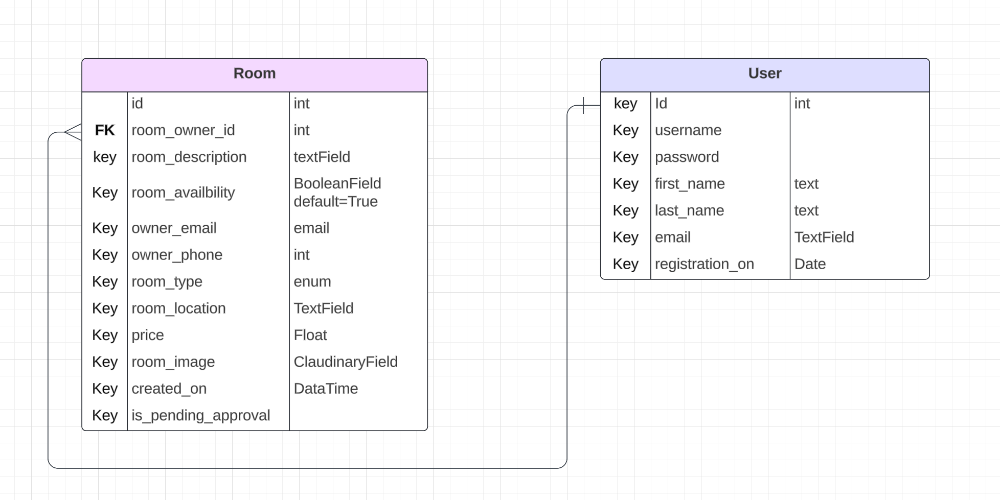
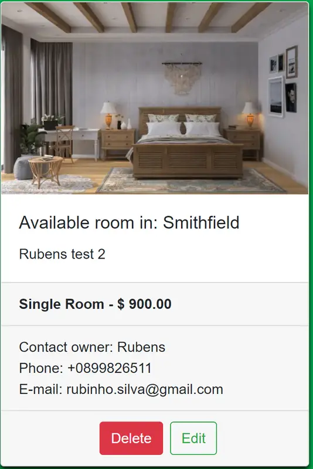

# Planning Phase

## Strategy:

### User Research:
Ireland attracts a large number of students from all over the world, making the search for accommodation challenging. Many students cannot afford expensive student accommodations and opt for cheaper options, such as shared houses with 2, 3, 4, or sometimes more roommates. Additionally, some students prefer single rooms depending on their budget.

*Note: The user research conducted for this project was based on personal experiences, as I, as an international student, faced similar challenges upon arriving in Ireland. Most of my friends also encountered similar difficulties.*

### Competitive Analysis:
Existing platforms often facilitate accommodation searches through real estate agencies, but response times can be slow due to high demand. Moreover, Facebook communities like "Brazilian Students in Dublin" or "Venezuelan Students in Dublin" also serve as a resource, but searching can be complicated due to various posts and outdated listings. Our platform will focus solely on available rooms, removing listings once they are rented out.

*Note: The competitive analysis was also informed by personal experiences and observations, recognizing the limitations of existing platforms.*

### Feature Prioritization:
Based on user research and competitive analysis, prioritize features that address the pain points identified. Key features include:
 - User-friendly room listing creation process, allowing users offering a room to specify details like price of rent, location, description and photos.
 - Robust search and filtering options to help users find suitable accommodation quickly.
 - Secure messaging system for communication between users interested in renting or listing rooms.
 - Communication with the Post Author, details offered like, email and phone.
 - User authentication and profile management functionalities like Delete and Edit posts.
 - Admin panel for content moderation and management to ensure the platform's integrity.

### User Personas:
Develop user personas representing different segments of the target audience, such as:
- **Maria:** A budget-conscious international student looking for an affordable shared room close to her university.
- **Ahmed:** An exchange student seeking a single room with specific amenities within a reasonable budget.
- **Emily:** A local homeowner interested in renting out a spare room to international students for extra income.

*Note: The creation of user personas was influenced by personal experiences and interactions with individuals facing similar accommodation challenges.*

### Brand Identity:
RoomFinder Ireland's brand identity, which includes the logo, colour scheme, and tone of voice, is designed to connect with its users. The logo represents simplicity and trust. The font is easy to read and friendly. The tone of voice is welcoming and helpful. Consistency across the platform ensures that users always feel at ease, reinforcing the platform's values of reliability, affordability, and inclusivity.

## Scope:

RoomFinder Ireland aims to provide a user-friendly online platform for international students in Ireland to find suitable accommodation. The scope of the project includes the development of key features essential for the platform's functionality and usability:

### User Registration and Authentication:
- Users will be able to create an account, providing necessary information such as name, email, and password.

### Room Listing Creation:
- Users can list available rooms for rent, specifying details like price of rent, room type (shared or single), location, description and photos.

### Location API Integration:
- Integration of a location API to provide advanced mapping and geocoding features, allowing users to visualize the location of listed rooms and find properties based on proximity to points of interest or specific areas of the city.

### Searching and Filtering:
- Students can search for available rooms based on criteria such as location, price range and room type.

### Messaging System:
- A secure messaging system would facilitate communication between users interested in renting or listing rooms, allowing for negotiation and arrangement of terms.

### Communication with Post Author:
- Users will have access to contact information, such as email and phone number of the author of a post, enabling direct communication for further inquiries or arrangements.

### User Management:
- Users will have the ability to manage their profiles, update personal information, view their own posts, and have options to delete or edit a post if needed.

### Admin Panel:
- An admin panel will allow for content moderation, user management, and monitoring of platform activity.

- Admins will be able to approve or unapprove a post for publication.

- Admins will have the capability to delete any post if necessary.

Additionally, features have been classified based on their importance using the MOSCOW prioritization:

UX efforts **must** address these:
- Register and Authentication.
- Login.
- Room Listing Creation.
- Post approved/unpproved (only by admin).
- User Profile Management.

Next topics, will be implemented in the future:

UX efforts **should have** these:
- Location API Integration.
- Room Searching and Filtering.
- Messaging System.

UX efforts **could have** these:
- Advanced Notification System: Implementation of an advanced notification system to alert users about new listings matching their preferences, updates on their inquiries, or important platform announcements.
- Social Media Integration: Integration with social media platforms to allow users to share listings or invite friends to join the platform, enhancing user engagement and expanding the platform's reach.
- Advanced Notification System: Implementation of an advanced notification system to alert users about new listings matching their preferences, updates on their inquiries, or important platform announcements.
- Review and Rating System: Incorporation of a review and rating system where users can provide feedback and rate their experiences with landlords and accommodations, helping other users make informed decisions.
- Localized Language Support: Addition of localized language support to cater to users from diverse linguistic backgrounds, providing a more inclusive experience and expanding the platform's accessibility.

## Structure
The structure of RoomFinder Ireland's platform is designed to ensure intuitive navigation and easy access to key features.

(I used [Lucidchart](https://www.lucidchart.com/) to help me visualize the user journey)

The flowchart illustrates the user journey within the platform, detailing every step from user registration to room listing creation, searching for accommodations, communication with post authors, and Admin management. Each stage is carefully mapped out to optimize user interaction and streamline the process of finding and renting accommodations

### User Stories:

- #### As **an Admin**...

As an **Admin**, I can **utilize a text editor within the admin panel** so that **I can create and edit room listings in a clear and visually appealing way.**

As an **Admin**, I can **filter and search all room listings from the admin page** so that **I can review, edit, and delete listings quickly.**

As an **Admin**, I can **easily navigate the admin panel** so that **I can view, search, add, and delete room listings.**

As an **Admin**, I can **approve new room listings offered by users for the community** so that **I can ensure listings are accurate and suitable.**

As an **Admin**, I can **access a list of pending room listings** so that **I can review details such as location, price, and photos.**

As an **Admin**, I can **reject room listings that do not meet the platform's standards or violate community guidelines** so that **I can provide clear reasons for rejection to users.**

As an **Admin**, I can **receive notifications when a room is rented** so that **remove the listing from the platform, ensuring accurate availability information for users searching for available rooms.**

- #### As a **user offering a room**...

As a **user offering a room**, I can **create an account** so that **I can access the platform's features.**

As a **user offering a room**, I can **easily create a listing for a room I have available for rent, providing all necessary details and photos**, so that **I can attract potential tenants.**

As a **user offering a room**, I can **receive an alert** so that **I am informed when my post has been submitted for review.**

As a **user offering a room**, I can **manage my room listings, including editing or deleting them as needed**, so that **I have control over my listings.**

As a **user offering a room**, I can **receive notifications when someone contacts me regarding my room listing, and I can respond promptly**, so that **I can engage with potential renters effectively.**

As a **user offering a room**, I can **easily find relevant contact information** so that **I can contact the site administrator via email if needed.**

- #### As a **user searching for a room**...

As a **user searching for a room** I can **create an account** so that **I can access all the features.**

As a **user searching for a room** I can **search for available rooms based on my preferences (location, price, type of room)** so that **I can find suitable accommodation that meets my needs.**

As a **user searching for a room** I can **view detailed information and photos of available rooms** so that **I can make informed decisions about potential accommodations.**

As a **user searching for a room** I can **get the contact details of the owner, such as email or phone** so that **I can communicate directly regarding the room.**

As a **user searching for a room** I can **access the platform from any screen size and still have a good browsing experience** so that **I can easily search for rooms using any device.**

As a **user searching for a room** I can **easily navigate to various pages of the website by typing a URL into the web browser** so that **can explore different listings effortlessly.**

As a **user searching for a room** I can **quickly locate relevant contact information** so that ** I can contact the site administrator via email if necessary.**

## Skeleton

The skeleton of RoomFinder Ireland's platform translates the structural design into wireframes, outlining the placement of key elements and functionalities on each page. Ensuring a clear and intuitive user experience. Key components of the skeleton include:

**Wireframes:** Wireframes are created for each page of the platform, depicting the layout of elements such as navigation bar, search filters, listing cards, room details, user profile, and messaging interface.

* [Homepage - Sign up](docs/images/homepage-signup.png)

* [Homepage - Logged in](docs/images/homepage-loggedin.png)

* [Creating a List](docs/images/create-a-list.png)

* [Available Rooms](docs/images/available-rooms.png)

**Responsive Design:** Special attention is given to ensuring that the platform is responsive across various devices and screen sizes. The wireframes are optimized to adapt seamlessly to laptops, tablets, and smartphones, providing a consistent user experience across all devices.

**Colour Scheme:**
The chosen colors for the project development were inspired by the colors of the Irish flag, which are green, white, and orange. Since the app is about room search in Ireland, I thought it would be a good idea for users to have this association in mind when accessing the platform.

I used the following [Ireland Flag](docs/images/flag02.png) to generate the following color scheme on coolers.co. The theme colors selected were: #03a64a (dark green), #02733e (light green), #f27405 (dark orange), #f25c05 (light orange), and #f2f2f2 (white) was added.

**Typography:**

The typography chosen for the project is "Roboto", a clean and modern sans-serif font. This font was selected for its readability and versatility, making it suitable for various text elements throughout the application.

**Database Schema:**

This diagram depicts the relationship between two tables: Room and User. The Room table stores information about available rental rooms, while the User table, provided by Django, stores user data.

The Room table is linked to the User table through a foreign key relationship using the room_owner_id field, representing the room owner.

Below is the preliminary layout for the database tables:

## Features:

**Navbar**:

I chose "RoomFinder Ireland" because it clearly tells users what the app does: helps them find rooms in Ireland. TThe inclusion of the magnifying glass symbolizes the search functionality, indicating to users that they can search for available rooms using the platform.
Additionally, the use of "RoomFinder Ireland" as the application name emphasizes its focus on room finding services specifically in Ireland.

**Signed Out**
When the user is signed out, they are directed to a simplified navbar with only "Register" and "Login" options.

**Signed In**

When signed in, users have access to all navigation links. Additionally, a message indicates the user's logged-in status, displaying their username.

As soon as the user signs in, a modal pops up:

**Log In**

The "Log In" page is a simple form requesting the username and password for users who already have an account.

**Register/Sign Up**

The "Register" or "Sign Up" page features a simple form for new users to create an account. The form typically includes fields for username, email, password, and password confirmation. Additionally, instructions are provided on password requirements for users.

**Log out**

The "Log Out" page displays a confirmation message asking the user if they really want to log out. If confirmed, a modal appears confirming the successful logout.

**Hamburguer menu**

On smaller screen sizes, a hamburger menu is displayed.

**Carousel**
A carousel effect on the homepage automatically displays several photos of rooms.

**Add a Room page**

The add_room page allows users to fill out a form with room information (listing), and upon submission, it is sent for approval by the admin. Once approved, it is available to view in card format on the room_finder page.

**Room finder page**

The room_finder page displays cards that have been approved by the admin. If the user is a superuser (admin), they have access to all the cards and can approve pending ones, as well as delete or edit existing ones. Regular users can only see approved cards, and they have the option to delete or edit their own listings if needed.

**Edit room page**

When a user clicks on the edit button, they are redirected to a page containing the same form as the add_room page. After making the necessary edits and submitting the form, the listing becomes pending approval by the admin.

**Delete Button**

Both superusers and regular users, when clicking on the delete button, are prompted with a modal for confirmation to ensure they indeed want to delete the post. This practice aims to provide a good user experience.

**Contact us page**

The "Contact Us" page is simple, providing direct contact information such as email, phone number, and links to social media profiles.

